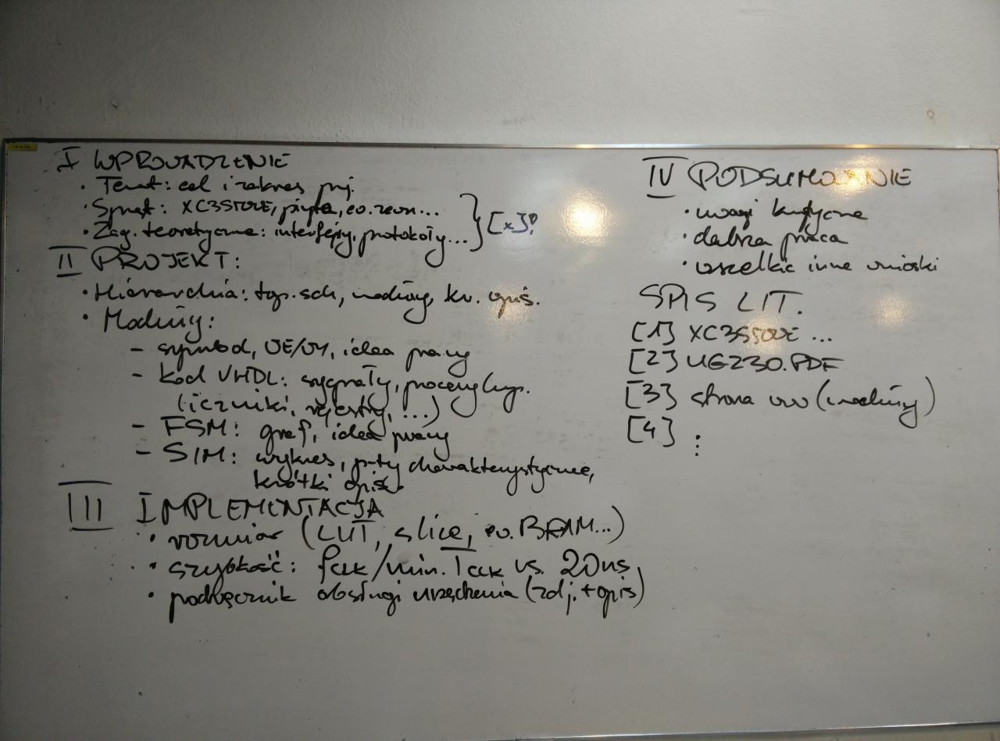

# Układy cyfrowe i systemy wbudowane 2
### Dokumentacja projektu

## Oscyloskop cyfrowy

Uczestnicy							| Prowadzący			| Termin zajęć			
------------------------------------|-----------------------|-----------------------
Olha Solovei (223176) Iwo Bujkiewicz (226203)	| Dr inż. Jarosław Sugier	| Wtorek parzysty 15:00

### 1. Wprowadzenie

#### 1. Cel i zakres projektu

Celem projektu było zbudowanie układu cyfrowego realizującego zadanie oscyloskopu cyfrowego. W zakres prac wchodziła implementacja wyświetlania przebiegu zarejestrowanego cyfrowo sygnału analogowego na podłączonym do układu monitorze VGA z określoną częstotliwością próbkowania.

#### 2. Sprzęt

Do realizacji projektu wykorzystano układ FPGA XC3S500E firmy Xilinx, zainstalowany na płycie Spartan-3E. Zestaw ten wyposażony był w wyjście obrazu w standardzie VGA, przetwornik analogowo-cyfrowy z przedwzmacniaczem, a także zestaw przełączników i przycisków [1], które również wykorzystano.
<!-- TODO Monitor i potencjomtr -->

#### 3. Zagadnienia teoretyczne

Zaprojektowany układ używa opisanych w [2] protokołów sterowania interfejsem VGA oraz przetwornikiem analogowo-cyfrowym (ADC) z przedwzmacniaczem, dostępnymi na płycie Spartan-3E. W celu ułatwienia korzystania z ADC, układ wykorzystuje podsystem `ADC_Ctrl` zaczerpnięty z [3]. Dodatkowo, podczas implementacji wyświetlania obrazu przez interfejs VGA, skorzystano z opisu synchronizacji sygnałów dla trybu VGA 800x600@72Hz, dostępnego w [4]. Przy tworzeniu kodu VHDL implementacji projektu korzystano również w celach referencyjnych z [5] oraz [6].

### 2. Projekt
<!--
* Hierarchia - schemat, przepływ danych, moduły napisane przez nas
* Wejścia/wyjścia
* Sygnały, procesy, liczniki, rejestry, etc.
* Graf maszyny stanów, idea pracy
* Symulacje - wykresy, któtki opis

potem w części drugiej, w hierarchii powinien się znaleźć top-level schematic, jakiś opis struktury układu, opis jak przepływają dane (jakie sygnały skąd dokąd są przekazywane i w jaki sposób), i opis co robią moduły (symbole na głównym schemacie) które my napisaliśmy i odniesienie do opisu tych które zrobił Sugier
potem dla modułów mają być opisy, jakie mają wejścia i wyjścia, jakich i do czego używają sygnałów, procesów, liczników, rejestrów itp., do tego graf i idea pracy automatu (maszyny stanów) oraz wykresy i krótkie opisy symulacji
-->

#### 1. Hierarchia

#### 2. Moduły

### 3. Implementacja
<!--
* Rozmiar implementacji, procent dostępnych zasobów
* Szybkość pracy
* Podręcznik obsługi urządzenia ze zdjęciami

potem przy implementacji trzeba napisać jaki rozmiar tego będzie i ile % dostępnych zasobów zajmie (w tym takie rzeczy jak Block RAM itp.)
z szybkością pracy to tam chodzi głównie o porównanie z zegarem 50 MHz (okres 20 ns), nie wiem o co mu tutaj tak dokładnie chodziło
do tego jakiś podręcznik obsługi dla użytkownika (co to robi, co trzeba podłączyć, co nacisnąć, itd.)
chciał zdjęcia w podręczniku obsługi, a ja zapomniałem zrobić zdjęć, ale mogę jakieś schematyczne rysunki ogarnąć
-->
#### 1. Rozmiar układu

#### 2. Szybkość pracy

#### 3. Podręcznik obsługi

### 4. Podsumowanie
<!--
w podsumowaniu rzeczy typu co zrobilibyśmy inaczej jakbyśmy pracowali nad tym od nowa, perspektywy dalszej rozbudowy układu, jakieś inne wnioski
-->
### 5. Literatura
<!--
na końcu "Literatura" czyli bibliografia z tymi przypisami
gdzie z automatu trzeba wrzucić opisy XC3S500E, User Guide 230 i stronę o układach Sugiera
-->
1. Xilinx, Inc., 2013. _Spartan-3E FPGA Family Data Sheet_ (https://www.xilinx.com)

1. Xilinx, Inc., 2011. _Spartan-3E FPGA Starter Kit Board User Guide_ (https://www.xilinx.com)

1. Sugier, J. _Zajęcia projektowe do przedmiotu "Układy cyfrowe i systemy wbudowane": Zestawy Digilent S3E-Starter_ (http://www.zsk.iiar.pwr.edu.pl/zsk_ftp/fpga/)

1. SECONS Ltd., 2008. _VESA Signal 800 x 600 @ 72 Hz timing_ (http://tinyvga.com/vga-timing/800x600@72Hz)

1. Zhang, W., 2001. _VHDL Tutorial: Learn by Example_ (University of California, Riverside, 2001) (http://esd.cs.ucr.edu/labs/tutorial/)

1. Hilbert, S., 2013. _VHDL Type Conversion (BitWeenie, LLC, 2013) (http://www.bitweenie.com/listings/vhdl-type-conversion/)
