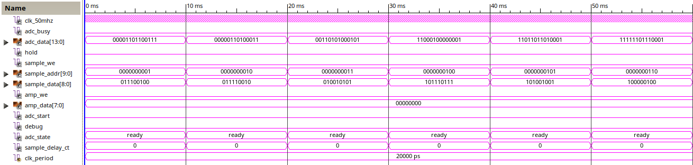
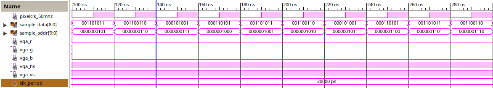
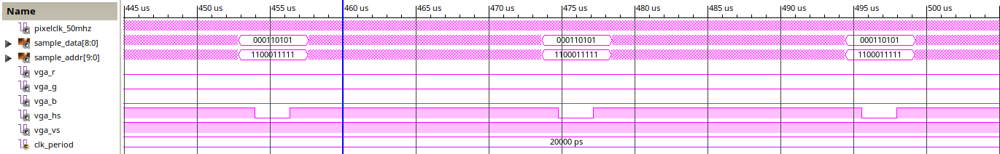
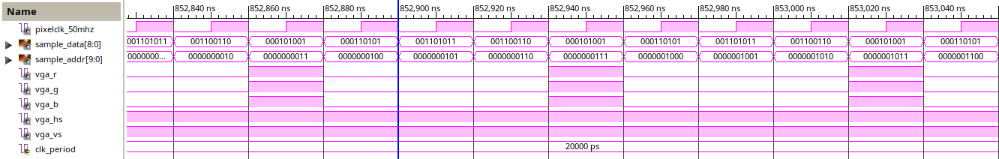
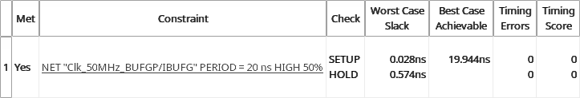

# Układy cyfrowe i systemy wbudowane 2
### Dokumentacja projektu

## Oscyloskop cyfrowy

Uczestnicy					| Prowadzący			| Termin zajęć			
----------------------------|-----------------------|---------------------------
Iwo Bujkiewicz (226203)		| Dr inż. Jarosław Sugier	| Wtorek parzysty 15:00


### 1. Wprowadzenie
#### 1. Cel i zakres projektu

Celem projektu było zbudowanie układu cyfrowego realizującego zadanie oscyloskopu cyfrowego. W zakres prac wchodziła implementacja wyświetlania zarejestrowanego cyfrowo z określoną częstotliwością próbkowania przebiegu sygnału analogowego na podłączonym do układu monitorze VGA.

#### 2. Sprzęt

Do realizacji projektu wykorzystano mikroukład FPGA XC3S500E firmy Xilinx, zainstalowany na płycie Spartan-3E. Zestaw ten wyposażony był [1] w wyjście obrazu w standardzie VGA, przetwornik analogowo-cyfrowy z przedwzmacniaczem, a także zestaw przełączników i przycisków, które również wykorzystano.

Zewnętrznie do zestawu podłączano monitor VGA, obsługujący tryb 800x600@72Hz, oraz potencjometr, służący jako źródło sygnału analogowego do próbkowania.

#### 3. Zagadnienia teoretyczne

Zaprojektowany układ używa opisanych w [2] protokołów sterowania interfejsem VGA oraz przetwornikiem analogowo-cyfrowym (ADC) z przedwzmacniaczem, dostępnymi na płycie Spartan-3E. W celu ułatwienia korzystania z ADC, układ wykorzystuje moduł `ADC_Ctrl` zaczerpnięty z [3]. Dodatkowo, podczas implementacji wyświetlania obrazu przez interfejs VGA, skorzystano z opisu synchronizacji sygnałów dla trybu VGA 800x600@72Hz, dostępnego w [4]. Przy tworzeniu kodu VHDL modułów projektu korzystano również w celach referencyjnych z [5] oraz [6].

<div class="page-break"></div>

### 2. Projekt
#### 1. Hierarchia

Głównym elementem projektu jest schemat połączeń logicznych.


_Ryc. 2.1. Główny schemat układu_

Na schemat składa się szereg modułów, odpowiadających za poszczególne funkcje podsystemowe:

* `ADC_Ctrl` - Moduł autorstwa dra Sugiera, ułatwiający sterowanie przetwornikiem analogowo-cyfrowym
* `Sampler` - Moduł odpowiedzialny za pobieranie cyfrowych próbek sygnału z `ADC_Ctrl` z odpowiednią częstotliwością i wpisywanie ich do pamięci
* `SampleMemory` - Pamięć dwuportowa przechowująca próbki
* `VGACtl` - Kontroler interfejsu VGA, pobierający próbki z pamięci i generujący na ich podstawie punkty na ekranie

W ogólnym ujęciu praca układu wygląda następująco:

* `Sampler` pobiera próbki cyfrowe z `ADC_Ctrl`
* `SampleMemory` przechowuje próbki i umożliwia ich odczyt i zapis
* `VGACtl` prezentuje próbki na wyświetlaczu przez interfejs VGA

#### 2. Moduły
##### Sampler
###### Zasada działania

Zadaniem `Sampler`a jest pobieranie próbek sygnału wejściowego, skonwertowanych na postać cyfrową przez ADC, i zapisywanie ich w pamięci układu.

1. `Sampler` wysyła do `ADC_Ctrl` impuls `ADC_Start` i oczekuje na wyłączenie sygnału `ADC_Busy`
1. Po odebraniu na wejściu `ADC_Data` 14-bitowej próbki `Sampler` wybiera z niej 9 najstarszych bitów i zamienia reprezentowaną przez nie liczbę na przeciwną
1. `Sampler` wysyła 9-bitową próbkę do pamięci poprzez port `Sample_Data` i wpisuje ją pod odpowiedni adres ustawiony na porcie `Sample_Addr`, wysyłając do `SampleMemory` impuls `Sample_WE`

<div class="page-break"></div>

###### Maszyna stanów

Cały stan modułu byłby trudny do przedstawienia na grafie automatu, jednak wyróżnić można maszynę stanów służącą do pobierania próbek z ADC.

  
_Ryc. 2.2. Sampler - Maszyna stanów_

* **q0** - `Idle` - stan bezczynności
* **q1** - `StartSent` - stan tuż po wysłaniu impulsu `ADC_Start`
* **q2** - `AwaitingSample` - stan oczekiwania na otrzymanie próbki od ADC
* **q3** - `SampleAcquired` - próbka została odczytana, przygotowywanie do zapisu w pamięci
* **q4** - `WriteEnableSent` - stan tuż po wysłaniu impulsu `Sample_WE` do zapisu próbki

###### Definicje wejść i wyjść

```VHDL
entity Sampler is
	Port ( Clk_50MHz : in  STD_LOGIC;
		ADC_Busy : in  STD_LOGIC;
		ADC_Data : in  STD_LOGIC_VECTOR (13 downto 0);
		Hold : in  STD_LOGIC;
		Sample_WE : out  STD_LOGIC := '0';
		Sample_Addr : out  STD_LOGIC_VECTOR (9 downto 0) := "0000000000";
		Sample_Data : out  STD_LOGIC_VECTOR (8 downto 0) := "000000000";
		AMP_WE : out  STD_LOGIC := '0';
		AMP_Data : out  STD_LOGIC_VECTOR (7 downto 0) := "00000000";
		ADC_Start : out  STD_LOGIC := '0';
		Debug : out  STD_LOGIC := '0');
end Sampler;
```

Wyjście `Debug` było potrzebne do rozwiązywania problemów z modułem i nie jest już wykorzystywane.

###### Sygnały wewnętrzne

```VHDL
architecture Behavioral of Sampler is
	Type SamplerState is (Ready);
	Type ScanState is (Idle, StartSent, AwaitingSample, SampleAcquired, WriteEnableSent);

	Signal state : SamplerState := Ready;
	Signal scan_state : ScanState := Idle;
	
	Signal clock_counter : INTEGER := 0;
	Signal sample_counter : INTEGER := 0;
	Signal pixel_counter : INTEGER := 0;
```

W swoich wewnętrznych sygnałach `Sampler` przechowuje aktualny stan modułu (w aktualnej wersji zawsze `Ready`, gdyż nie zajmuje się inicjalizacją przedwzmacniacza ADC, jak zakładano na początku) oraz aktualny stan operacji uzyskiwania próbki. Oprócz tego, moduł posiada trzy wewnętrzne liczniki:

<div class="page-break"></div>

* `clock_counter` - przechowuje liczbę cykli zegara, które upłynęły od ostatniego rozpoczęcia pobierania próbki; służy to pobieraniu próbek w równych odstępach, ustalonych według częstotliwości próbkowania;
* `sample_counter` - przechowuje numer aktualnie pobieranej próbki; służy do określenia, pod jaki adres w pamięci należy zapisać próbkę;
* `pixel_counter` - służy odmierzaniu odstępów czasowych między kolejnymi odświeżeniami pionowymi VGA, aby zapobiec nadpisywaniu próbek aktualnie rysowanych na wyświetlaczu.

###### Procesy

```VHDL
Sample_scan : process ( Clk_50MHz ) is
begin
	if (rising_edge(Clk_50MHz) and state = Ready) then
		if (scan_state = Idle and clock_counter = 0 and Hold = '0') then
			ADC_Start <= '1';
			scan_state <= StartSent;
		elsif (scan_state = StartSent) then
			if (ADC_Busy = '1') then
				ADC_Start <= '0';
				scan_state <= AwaitingSample;
			end if;
		elsif (scan_state = AwaitingSample) then
			if (ADC_Busy = '0') then
				Sample_Data <= ADC_Data(13) & (not ADC_Data(12 downto 5));
				Sample_Addr <= std_logic_vector(to_unsigned(sample_counter, 10));
				scan_state <= SampleAcquired;
			end if;
		elsif (scan_state = SampleAcquired) then
			Sample_WE <= '1';
			scan_state <= WriteEnableSent;
		elsif (scan_state = WriteEnableSent) then
			Sample_WE <= '0';
			scan_state <= Idle;
		end if;
	end if;
end process;
```

Proces `Sample_scan` implementuje maszynę stanów, realizującą pobieranie próbek z ADC i zapisywanie ich do `SampleMemory`.

<p>&nbsp;</p>

```VHDL
Sample_ct : process ( Clk_50MHz ) is
begin
	if (rising_edge(Clk_50MHz) and state = Ready) then
		if (clock_counter = 0 and Hold = '0') then
			sample_counter <= sample_counter + 1;
			if (sample_counter >= 800 and pixel_counter >= 692640) then
				sample_counter <= 0;
			end if;
		end if;
	end if;
end process;
```

`Sample_ct` zlicza pobierane próbki, aby określić dla każdej z nich adres w pamięci.

<div class="page-break"></div>

```VHDL
Sampling_rate_ct : process ( Clk_50MHz, clock_counter ) is
begin
	if (falling_edge(Clk_50MHz)) then
		if (clock_counter < 500000) then
			clock_counter <= clock_counter + 1;
		else
			clock_counter <= 0;
		end if;
	end if;
end process;
```

`Sampling_rate_ct` odmierza równe odstępy między możliwymi włączeniami impulsu `ADC_Start`, aby próbki pobierane były zgodnie z ustaloną częstotliwością próbkowania. Proces ten odmierza 500 tysięcy cykli zegara, zatem częstotliwość próbkowania wynosi 100 Hz (± odchylenie taktu zegara).

<p>&nbsp;</p>

```VHDL
Pixel_ct : process ( Clk_50MHz, pixel_counter ) is
begin
	if (falling_edge(Clk_50MHz)) then
		if (pixel_counter < 692640) then
			pixel_counter <= pixel_counter + 1;
		else
			pixel_counter <= 0;
		end if;
	end if;
end process;
```

`Pixel_ct` odmierza czas odświeżenia pojedynczej klatki obrazu na wyświetlaczu, aby  próbki mogły być zapisywane do pamięci tylko raz na odświeżenie.

###### Symulacja

W symulacji użyto dodatkowych sygnałów `adc_state` oraz `sample_delay_ct`, niebędących częścią modułu.


_Ryc. 2.3. Sampler - Symulacja_

Wycinek symulacji modułu widoczny na Ryc. 2.3. przedstawia pobieranie próbek co 10 ms, czyli 100 razy na sekundę, zgodnie z częstotliwością próbkowania. Adres do zapisu próbki w pamięci jest za każdym razem inkrementowany, a zapisywana wartość jest poprawnie ustawiana na 9 najstarszych bitów liczby otrzymanej od ADC.


_Ryc. 2.4. Sampler - Symulacja_

<div class="page-break"></div>

Na Ryc. 2.4. widać w większym szczególe proces pobrania pojedynczej próbki. `sample_delay_ct` odmierza 36 cykli zegara, podczas których sygnał `ADC_Busy` jest włączony, a `Sampler` oczekuje na próbkę. Gdy ją otrzyma, ustawia wartość do niej przeciwną oraz jej numer odpowiednio na wyjścia `Sample_Data` i `Sample_Addr`, a następnie wysyła impuls `Sample_WE`.

##### SampleMemory
###### Zasada działania

`SampleMemory` implementuje dwuportowy RAM do przechowywania zebranych z ADC próbek.

1. Gdy wejście `Write_Enable` jest wysokie, pod adres w pamięci określony sygnałem `Write_Addr` zapisywana jest pojedyncza próbka o wartości określonej sygnałem `Write_Data`
1. Na wyjście `Read_Data` zawsze podawana jest wartość próbki przechowywanej pod adresem określonym przez `Read_Addr`

###### Definicje wejść i wyjść

```VHDL
entity SampleMemory is
	Port ( Clk : in  STD_LOGIC;
		Write_Enable : in  STD_LOGIC;
		Write_Addr : in  STD_LOGIC_VECTOR (9 downto 0);
		Write_Data : in  STD_LOGIC_VECTOR (8 downto 0);
		Read_Addr : in  STD_LOGIC_VECTOR (9 downto 0);
		Read_Data : out  STD_LOGIC_VECTOR (8 downto 0));
end SampleMemory;
```

###### Sygnały wewnętrzne

```VHDL
architecture Behavioral of SampleMemory is
	Type storage_type is array (0 to 799) of std_logic_vector (8 downto 0);                 
	Signal samples : storage_type := ("000000000", "000000000", "000000000", "000000000", "000000000", "000000000", "000000000", "000000000",
	                                  "000000000", "000000000", "000000000", "000000000", "000000000", "000000000", "000000000", "000000000",
		(...)
```

Jedynym stanem wewnętrznym `SampleMemory` są zapisane próbki. Przechowywane są one w tablicy 800 elementów typu `STD_LOGIC_VECTOR`, których początkowe wartości (zera) zdefiniowane są na stałe w deklaracji sygnału.

###### Procesy

```VHDL
Read_write : process (Clk)
begin
   if ( rising_edge(Clk) ) then
	  if (Write_Enable = '1') then
		 samples(to_integer(unsigned((Write_Addr)))) <= Write_Data;
	  end if;
	  Read_Data <= samples(to_integer(unsigned((Read_Addr))));
   end if;
end process;
```

Jedyny proces tego modułu jest odpowiedzialny za realizację całej jego funkcjonalności - zapisywania próbek przy wysokim `Write_Enable` oraz odczytywania próbek na postawie `Read_Addr`.

<div class="page-break"></div>

###### Symulacja


_Ryc. 2.5. SampleMemory - Symulacja_

Wykres symulacji ilustruje działanie modułu. Można zauważyć odczyt próbki `001101011` spod adresu `0000110010`, która została tam uprzednio zapisana.

##### VGACtl
###### Zasada działania

`VGACtl` służy do wyświetlania zapisanych próbek na zewnętrznym wyświetlaczu VGA.

1. `VGACtl` wylicza, na podstawie wewnętrznych liczników, adres próbki do pobrania z pamięci i ustawia go na wyjściu `Sample_Addr`
1. Od `SampleMemory` odbierana jest wartość próbki na wejściu `Sample_Data`
1. Jeśli `VGACtl` odświeża aktualnie pixel (`Sample_Addr`, `Sample_Data`), to rysuje na wyświetlaczu biały punkt, ustawiając wyjścia `VGA_R`, `VGA_G` oraz `VGA_B` na stan wysoki; w przeciwnym przypadku używa koloru czarnego, czyli stanu niskiego na wspomnianych wyjściach.
1. `VGACtl` synchronizuje wyświetlacz z układem za pomocą sygnałów vertical sync (`VGA_VS`) i horizontal sync (`VGA_HS`), sterowanych na podstawie wewnętrznych liczników, w taki sposób, aby wyświetlacz pracował w trybie 800x600@72Hz

###### Definicje wejść i wyjść

```VHDL
entity VGACtl is
	Port ( PixelClk_50MHz : in  STD_LOGIC;
		   Sample_Data : in  STD_LOGIC_VECTOR (8 downto 0);
		   Sample_Addr : out  STD_LOGIC_VECTOR (9 downto 0) := "0000000000";
		   VGA_R : out  STD_LOGIC := '0';
		   VGA_G : out  STD_LOGIC := '0';
		   VGA_B : out  STD_LOGIC := '0';
		   VGA_HS : out  STD_LOGIC := '0';
		   VGA_VS : out  STD_LOGIC := '0');
end VGACtl;
```

###### Sygnały wewnętrzne

```VHDL
architecture Behavioral of VGACtl is
	Signal vs_counter : INTEGER := 0;
	Signal hs_counter : INTEGER := 0;
```

`VGACtl` przechowuje w dwóch licznikach aktualną pionową i poziomą pozycję na powierzchni wyświetlacza, aby wiedzieć, który pixel jest aktualnie rysowany oraz kiedy należy wysłać niskie impulsy synchronizujące VGA.

<div class="page-break"></div>

###### Procesy

```VHDL
Horizontal_sync : process ( PixelClk_50MHz, hs_counter ) is
begin
	if (rising_edge(PixelClk_50MHz)) then
		if (hs_counter < -64) then
		VGA_HS <= '0';
	 else
		VGA_HS <= '1';
	 end if;
	end if;
end process;
```

Proces `Horizontal_sync` odpowiada za wysłanie w odpowiednim momencie synchronizacji poziomej niskiego impulsu na wyjściu `VGA_HS`, aby wyświetlacz rozpocząć odświeżanie kolejnej linii.

<p>&nbsp;</p>

```VHDL
Vertical_sync : process ( PixelClk_50MHz, vs_counter ) is
begin
	if (rising_edge(PixelClk_50MHz)) then
		if (vs_counter < -23) then
		VGA_VS <= '0';
	 else
		VGA_VS <= '1';
	 end if;
	end if;
end process;
```

`Vertical_sync` wypełnia to samo zadanie w synchronizacji pionowej, aby wyświetlacz mógł rozpocząć odświeżanie kolejnej klatki obrazu.

<p>&nbsp;</p>

```VHDL
Pixel_counters : process ( PixelClk_50MHz, hs_counter ) is
begin
	if (falling_edge(PixelClk_50MHz)) then
		if (hs_counter = 855) then
			hs_counter <= -184;
			if (vs_counter = 636) then
				vs_counter <= -29;
			else
				vs_counter <= vs_counter + 1;
			end if;
		else
			hs_counter <= hs_counter + 1;
		end if;
	end if;
end process;
```

Proces `Pixel_counters` aktualizuje liczniki `vs_counter` oraz `hs_counter`, zliczając linie obrazu i pixele w liniach, uwzględniając także zakresy startowe i końcowe dla każdej klatki i linii, znajdujące się poza wyświetlanym obrazem.

<div class="page-break"></div>

```VHDL
Pixel_search : process ( vs_counter, hs_counter ) is
begin
	if (hs_counter >= 0 and hs_counter < 800) then
		Sample_Addr <= std_logic_vector(to_unsigned(hs_counter, 10));
		if (vs_counter = to_integer(unsigned(Sample_Data))) then
			VGA_R <= '1';
			VGA_G <= '1';
			VGA_B <= '1';
		else
			VGA_R <= '0';
			VGA_G <= '0';
			VGA_B <= '0';
		end if;
	else
		VGA_R <= '0';
		VGA_G <= '0';
		VGA_B <= '0';
	end if;
end process;
```

`Pixel_search` odczytuje próbki z `SampleMemory` i porównuje ich wartości ze współrzędną aktualnie odświeżanej linii obrazu. Jeśli się zgadzają, ustawia na wyjściu koloru VGA kolor biały, w przeciwnym wypadku kolor czarny.

###### Symulacja


_Ryc. 2.6. VGACtl - Symulacja_

Ryc. 2.6. przedstawia okres czasu odpowiadający odświeżeniu jednej klatki obrazu. Można zaobserwować niski impuls na wyjściu `VGA_VS` podczas przejścia do kolejnej klatki, a także zmiany `VGA_R`, `VGA_G` i `VGA_B` podczas rysowania białych punktów reprezentujących próbki.


_Ryc. 2.7. VGACtl - Symulacja_

Na Ryc. 2.7. można zaobserwować odczytywanie kolejnych próbek w takt zegara 50 MHz.


_Ryc. 2.8. VGACtl - Symulacja_

Na Ryc. 2.8. widoczne jest odświeżenie dwóch pełnych linii obrazu. Wyróżniają się niskie impulsy na wyjściu `VGA_HS` oraz przerwa w odczycie próbek, gdy liczniki `vs_counter` i `hs_counter` wskazują na pozycje poza obrazem.


_Ryc. 2.9. VGACtl - Symulacja_

Rozświetlanie pixeli obrazu widoczne jest na Ryc. 2.9.

##### ADC_Ctrl

Opis modułu można znaleźć w [3].

### 3. Implementacja
#### 1. Rozmiar układu

Zaprojektowany układ wykorzystuje stosunkowo niewielką część zasobów mikroukładu XC3S500E. Największe wykorzystanie zasobów można zauważyć wśród bloków wejścia/wyjścia, co spowodowane jest użyciem przez moduł `ADC_Ctrl` dużej liczby portów do komunikacji z ADC.

Logic Utilization | Used | Available | Utilization
---|---|---|---
Total Number Slice Registers | 262 | 9,312 | 2%
Number used as Flip Flops | 252 |  |
Number used as Latches | 10 |  |
Number of 4 input LUTs | 177 | 9,312 | 1%
Number of occupied Slices | 223 | 4,656 | 4%
Number of Slices containing only related logic | 223 | 223 | 100%
Number of Slices containing unrelated logic | 0 | 223 | 0%
Total Number of 4 input LUTs | 347 | 9,312 | 3%
Number used as logic | 176 |  |
Number used as a route-thru | 170 |  |
Number used as Shift registers | 1 |  |
Number of bonded IOBs | 31 | 232 | 13%
Number of IDDR2s used | 1 |  |
Number of ODDR2s used | 2 |  |
Number of RAMB16s | 1 | 20 | 5%
Number of BUFGMUXs | 1 | 24 | 4%
Average Fanout of Non-Clock Nets | 2.62 |  |

<div class="page-break"></div>

Poniżej widoczne są statystyki użycia różnych elementów logicznych.

* Comparators=9
	* 32-bit comparator equal=1
	* 32-bit comparator greatequal=3
	* 32-bit comparator less=5
* Counters=5
	* 32-bit up counter=5
* Latches=1
	* 10-bit latch=1
* RAMs=1
	* 800x9-bit dual-port block RAM=1
* Registers=28
	* Flip-Flops=28

#### 2. Szybkość pracy

Cały układ taktowany jest zegarem 50 MHz, czyli o okresie 20 ns. Ograniczenia synchronizacyjne układu powodują, że faktyczny okres zegara nieznacznie odbiega od idealnego i wynosi 19.944 ns.



#### 3. Podręcznik obsługi

Oscyloskop powinien zostać zaprogramowany na płycie Spartan-3E z mikroukładem FPGA XC3S500E.


_Ryc. 3.1. Istotne elementy płyty Spartan-3E_

<div class="page-break"></div>

Aby uruchomić oscyloskop, należy wykonać następujące czynności:

1. Podłączyć płytę Spartan-3E do odpowiedniego źródła zasilania
1. Podłączyć do 15-pinowego złącza VGA zewnętrzny wyświetlacz (dowolne urządzenie mogące wyświetlać obraz w rozdzielczości 800x600 z częstotliwością odświeżania pionowego 72 Hz)
1. Podłączyć źródło sygnału analogowego do styku `VINA` w bloku złącz `D/A and A/D header`; Napięcie sygnału będzie mierzone względem potencjału na styku `GND` w tym samym bloku - można użyć tego styku jako wartość odniesienia dla urządzenia będącego źródłem sygnału. Dostępny jest również styk `VCC3V3`, przenoszący potencjał +3.3 V wzgłędem `GND`, który również może być wykorzystany jako wartość odniesienia.
1. Włączyć zasilanie płyty za pomocą przełącznika opisanego jako "Power switch"
1. Ustawić przełączniki, opisane jako "Switches", w pozycjach odpowiadających żądanemu wzmocnieniu sygnału wejściowego przez przedwzmacniacz ADC; Możliwe wartości wzmocnień można znaleźć w [2] (Rozdział 10. "Analog Capture Circuit", sekcja "Programmable Pre-Amplifier", ustęp "Programmable Gain"). Ustawienie przełącznika w pozycji wysokiej (`1`) oznacza przesunięcie go w stronę środka płyty.
1. Przekręcić pokrętło "Rotary Encoder" w prawo o jeden przeskok
1. Powtórzyć poprzedni krok, jeżeli występuje problem z obserwacją próbkowanego sygnału


_Ryc. 3.2. Schemat połączenia urządzeń_

### 4. Podsumowanie

Zaprojektowany układ działa zgodnie z oczekiwaniami, jednak nie jest pozbawiony wad.

Przede wszystkim inicjalizacja przedwzmacniacza ADC realizowana jest ręcznie za pomocą pokrętła na płycie, zamiast automatycznie z poziomu układu, co znacznie utrudnia wygodne korzystanie z urządzenia. Występują też pewne niedoskonałości w kodzie modułów, które nie uniemożliwiają używania oscyloskopu, jednak mogą okazać się problematyczne w pewnych zastosowaniach.

Obecnie częstotliwość próbkowania jest ustalona na stałe wewnątrz kodu modułu `Sampler`. Dużą poprawą użyteczności oscyloskopu byłoby umożliwienie zmiany częstotliwości próbkowania za pomocą pokrętła. Moduł został do takiej zmiany wstępnie przystosowany, jednak nie posiada on odpowiedniej funkcjonalności.

W układzie zaimplementowano tzw. "Hold", czyli wstrzymanie próbkowania sygnału wejściowego w celu łatwiejszej jego analizy na wyświetlaczu. Niestety, ze względu na problemy z inicjalizacją przedwzmacniacza ADC i konieczność wyprowadzenia innych wejść na przełączniki płyty, funkcjonalność "Hold" nie jest dostępna w gotowej implementacji, co dla poprawy użyteczności oscyloskopu powinno zostać poprawione.

Autor projektu doszedł do wniosku, że gdyby od samego początku stosował w kodzie VHDL wzorzec maszyny stanów, tworzenie modułów układu zajęłoby o wiele mniej czasu.

<div class="page-break"></div>

### 5. Literatura

1. Xilinx, Inc., 2013. _Spartan-3E FPGA Family Data Sheet_  
	(https://www.xilinx.com/support/documentation/data_sheets/ds312.pdf)

1. Xilinx, Inc., 2011. _Spartan-3E FPGA Starter Kit Board User Guide_  
	(https://www.xilinx.com/support/documentation/boards_and_kits/ug230.pdf)

1. Sugier, J. _Zajęcia projektowe do przedmiotu "Układy cyfrowe i systemy wbudowane": Zestawy Digilent S3E-Starter_  
	(http://www.zsk.iiar.pwr.edu.pl/zsk_ftp/fpga/)

1. _VESA Signal 800 x 600 @ 72 Hz timing_ (SECONS Ltd., 2008)  
	(http://tinyvga.com/vga-timing/800x600@72Hz)

1. Zhang, W., 2001. _VHDL Tutorial: Learn by Example_ (University of California, Riverside, 2001)  
	(http://esd.cs.ucr.edu/labs/tutorial/)

1. Hilbert, S., 2013. _VHDL Type Conversion_ (BitWeenie, LLC, 2013)  
	(http://www.bitweenie.com/listings/vhdl-type-conversion/)
